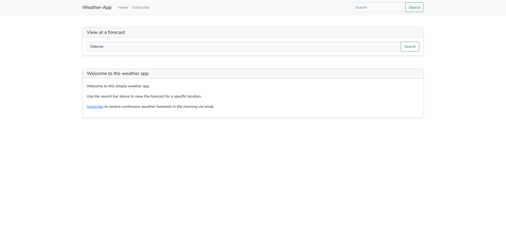
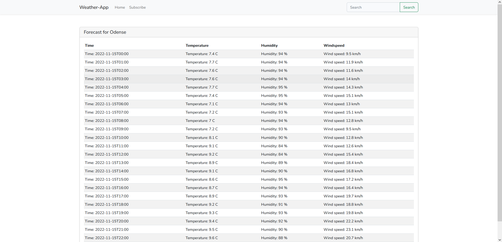
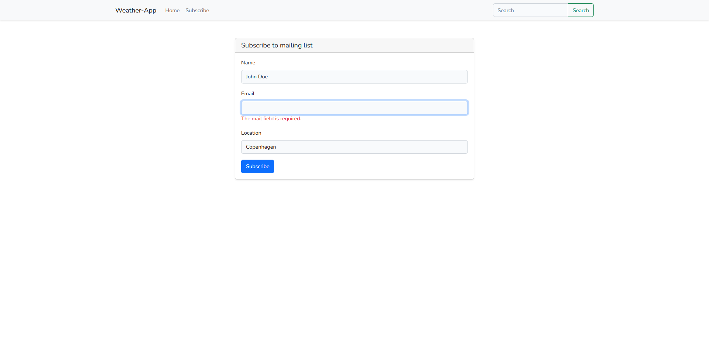

# Weather App
A simple weather forecast app created in Laravel.

[](https://github.com/KredeGC/weather-app/blob/master/LICENSE)
[](https://github.com/KredeGC/weather-app/actions/workflows/main.yml)

# Features
* View forecasts in specific locations by searching for its name.
* Subscribe to a mailing list to receive forecasts from a given location daily at 6:00.
* Unsubscribe from forecasts you no longer need by clicking a link in an email.

# Building & running
You can either use Laravel with normal PHP, composer and npm or Laravel Sail, which uses a docker container.

Installing normally can be done using:
```bash
composer install
npm install
npm run build
cp example.env .env
php artisan key:generate
php artisan serve
```

Installing with Sail can be done using:
```bash
docker run --rm \
    -u "$(id -u):$(id -g)" \
    -v $(pwd):/var/www/html \
    -w /var/www/html \
    laravelsail/php81-composer:latest \
    composer install --ignore-platform-reqs
npm install
npm run build
cp example.env .env
./vendor/bin/sail up -d
./vendor/bin/sail artisan key:generate
```

# Media
The home page.


Weather forecast for Odense


The mailing list subscribe page, showing a required field.
